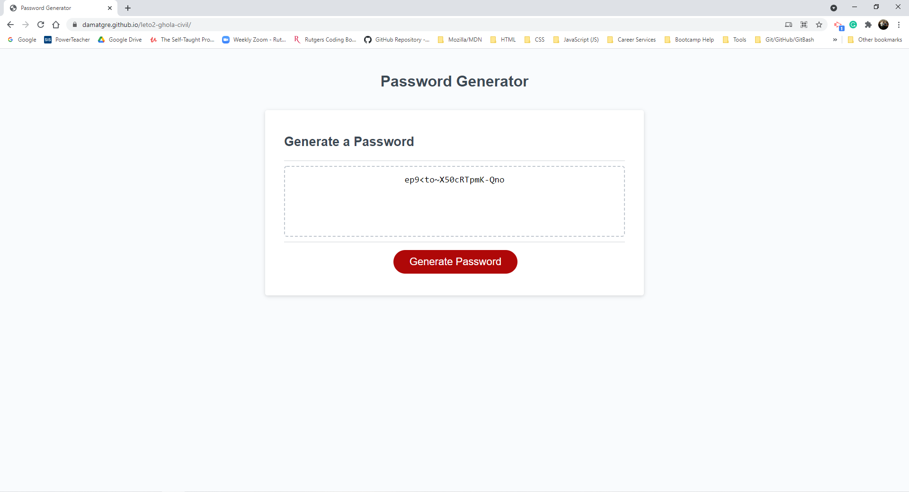

# leto2-ghola-civil

## Description

This project is a password generator. It allows the user to choose from a variety of options to randomly generate a password. The user first selects how many characters they would like in their password, and then they are prompted by a series of four questions. The user is asked whether they would like uppercase letters, lowercase letters, numbers, and special characters included in their password.

The user makes their selections using confirm boxes. If the user clicks "OK", the user's password will include the element they selected. If the user selects "Cancel", then the element will not be factored into their password. 

## Links

[Link to repository](https://github.com/damatgre/leto2-ghola-civil)
[Link to website](https://damatgre.github.io/leto2-ghola-civil/)

## Screenshots

